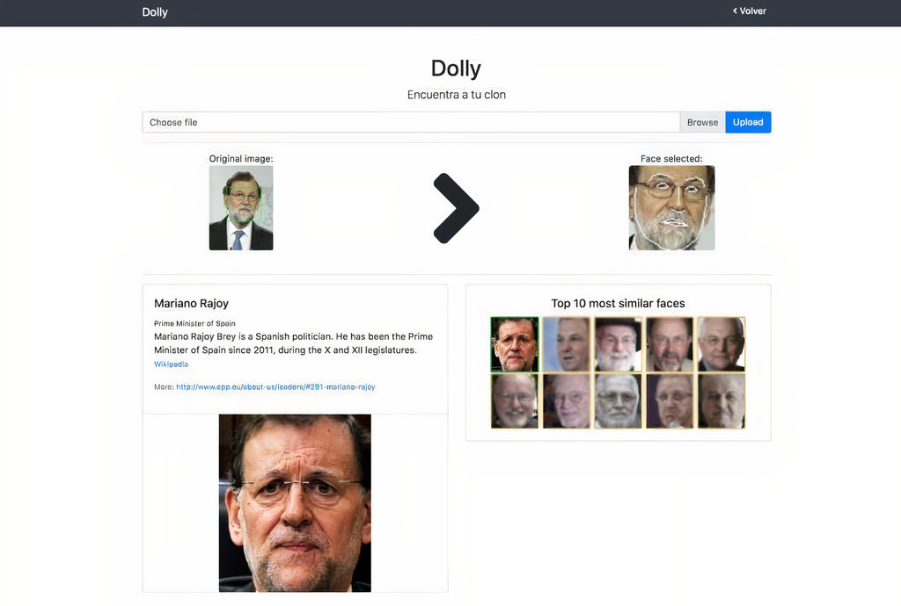

# Dolly
Dolly is a simple library to find your clones!
Additionally, you can use it to detect faces, crop them, draw boxes, landmarks,...

This project is based on [dlib](http://dlib.net) and [face_recognition](https://github.com/ageitgey/face_recognition)



## Installation

### Requirements

  * Python 3.3+ or Python 2.7
  * macOS or Linux (Windows not officially supported, but might work)

### Installation Options:

#### Installing on Mac or Linux

Install this module from pypi using `pip3` (or `pip2` for Python 2):

```
pip3 install ./dolly
```


## Usage

### From the command line

#### `findclones` command line tool

Find your clone, returns the top K most similar faces in our database
```
usage: dolly [-h] -f FILENAME [-k TOP_K] [--in_memory IN_MEMORY] [--model MODEL] command


$ dolly findclones -f ./obama.jpg -k 3 --in_memory True --model 'hog'
    #1. Barack Obama;	EntityID: m.02mjmr;	Distance: 0.031694889068603516;
    #2. David Trezeguet;	EntityID: m.02wxpm;	Distance: 0.07425856590270996;
    #3. Sanjeev Kapoor;	EntityID: m.07vynh;	Distance: 0.07822000980377197;
```


#### `findfaces` command line tool
Find faces in an image, and optionally, they can be cropped and saved in a directory.

```
usage: dolly [-h] -f NP_IMAGE [-d SAVE_PATH] command


$ dolly findfaces -f ./obama.jpg
    - Face #1: (top=44, right=187, bottom=152, left=79) - 108x108px
```


#### `findfacesdir` command line tool
Find faces in all the images of a directory, then, the faces are cropped and saved into another directory.

```
usage: dolly [-h] -d DIRECTORY -d2 SAVE_PATH [-m MAX_FACES] command


$ dolly findfacesdir -d original/ -d2 cropped/
    Finding faces (1) in: obama.jpg
        - Face #1: (top=44, right=187, bottom=152, left=79) - 108x108px
    Finding faces (2) in: two_people.jpg
        - Face #1: (top=57, right=964, bottom=242, left=778) - 186x185px
        - Face #2: (top=47, right=408, bottom=202, left=253) - 155x155px
    Finished.
    A total of 3 images were added
```


#### `drawboxes` command line tool

Draw a rectangle on the face

```
usage: dolly [-h] -f FILENAME -s SAVE_PATH command

$ dolly drawboxes -f ./obama.jpg -s ./obama_boxes.jpg
```


#### `drawlandmarks` command line tool

Draw the set of landmarks on the face

```
usage: dolly [-h] -f FILENAME -s SAVE_PATH command

$ dolly drawlandmarks -f ./obama.jpg -s ./obama_landmarks.jpg
```


### Python scripting

#### Find your clones

```
from dolly.findclones import Finder
from dolly.db import create_connection

# Set working directory and database (example)
BASE_DIR = os.path.join(os.path.dirname(os.path.dirname(__file__)), 'data/production/{}/{}/'.format(dataset, version))
database = os.path.join(BASE_DIR, 'db/msceleb.sqlite')

# Instanciate Finder
f = Finder(db_conn=create_connection(database), data_path=BASE_DIR)

# Get face attributes (f_enc = face encodings)
f_loc, f_lmarks, f_enc = analyze_face(np_image=np_image, model=model)

# Find (top 3) clones and print results
res = f.findclones(face_encoding=f_enc, top_k=3)
f.print_results(res)

>>>
#1. Barack Obama;	EntityID: m.02mjmr;	Distance: 0.031694889068603516;
#2. David Trezeguet;	EntityID: m.02wxpm;	Distance: 0.07425856590270996;
#3. Sanjeev Kapoor;	EntityID: m.07vynh;	Distance: 0.07822000980377197;
```

#### Draw face boxes

```
from dolly.processing import draw_boxes
from dolly.utils import image_loader

filename = './original/obama.jpg'
save_path = './cropped/obama_boxes.jpg'

# Draw boxes and save it
res = draw_boxes(np_image=image_loader(filename), save_path=save_path)
```

#### More

For more examples, check the tests files.

### Working directory

Default datasets are located `dolly/data/`, but you can have yours wherever you want. The only requirement is that
all datasets should follow the same structure: `./{name}/{version}/{db/ + images/ + pickle/}`

```
dolly
  |
  |-- data
        |--production
                |-- {name} (e.g: msceleb)
                       |-- {version} (e.g.: v1)
                                |-- db/
                                |-- images/
                                |-- pickle/
```

- Inside `db/` we can find a *sqlite* database which contains two relevant tables: `entities` and `faces`:
    - **Entities**: Contains information about the unique persons in the DB.
    

    - **Faces**: Contains information about each face in the database
    

- Then, in `pickle/` we can find two pickle files (`np_encodings.pkl` and `np_ids.pkl`) that store the numpy ndarray of encodings and faces IDs in the DB.
- Finally, we have `images/`, where all the faces of each person are saved inside its folder (identify by its `freebase_mid`)

